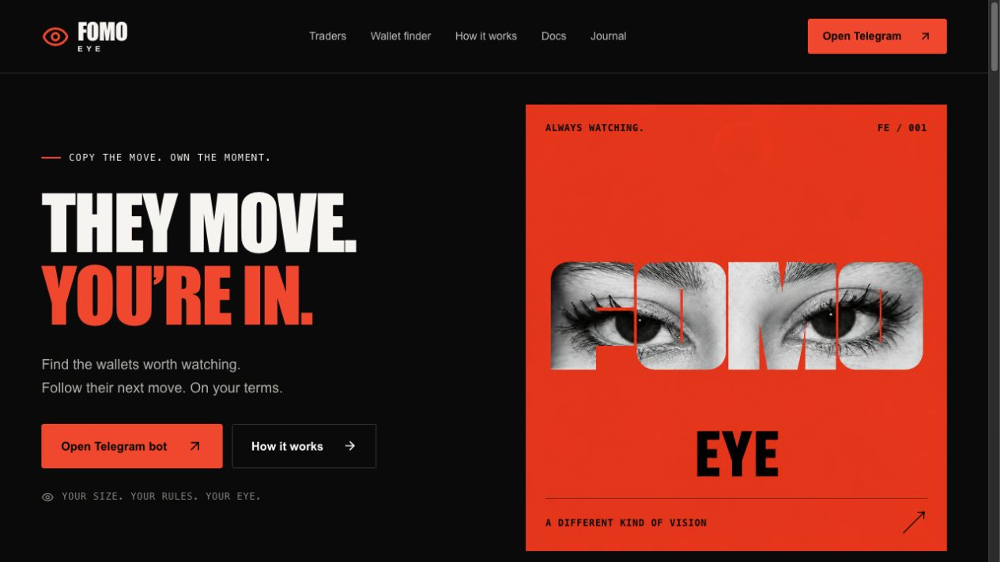
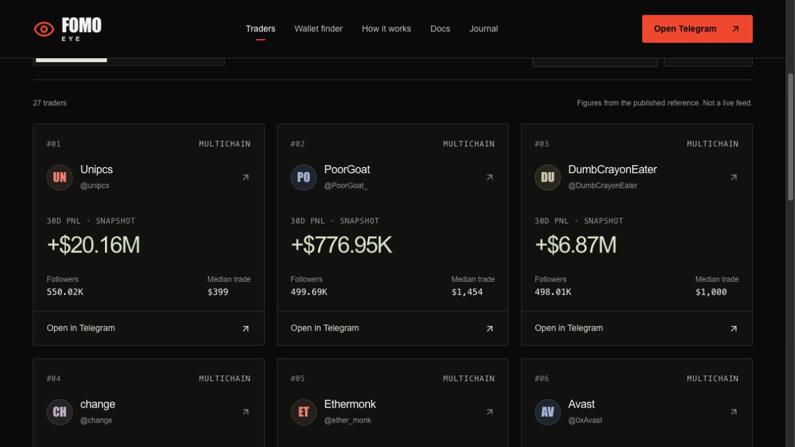
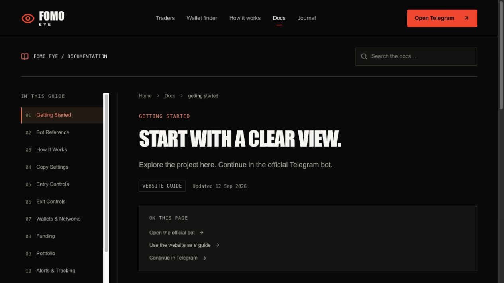
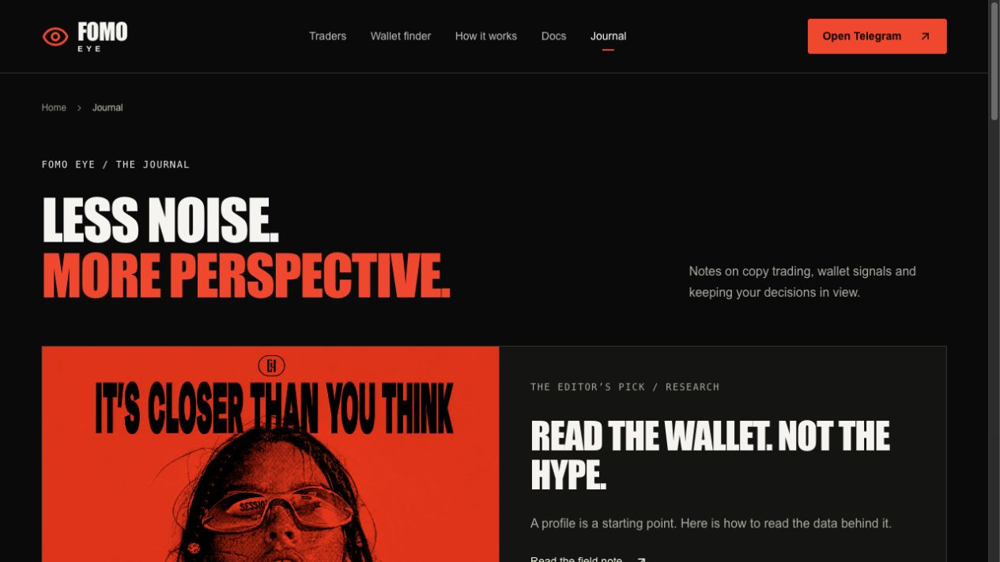

# FOMO EYE - website update

**12 September 2026 · Website built and uploaded to hosting**

FOMO EYE now has a dedicated website: a visual introduction to the project, a reference trader directory, a knowledge hub and a direct route to the Telegram bot. The website helps visitors understand the product and choose their next step. Account operations take place in Telegram.

[Explore the hosted preview](https://darkgoldenrod-butterfly-749651.hostingersite.com/) · [Open the bot](https://t.me/fomo_eye_bot) · [Follow on X](https://x.com/fomo_eye)

The purchased project domain is **[fomoeye.com](https://fomoeye.com)**. At the time of this update, its registration was still under review by the hosting provider. The hosted preview is available independently of that review.

## Visual direction

The design uses a near-black background, vivid red accents, oversized condensed typography and the project's eye imagery. The supplied FOMO EYE artwork leads the homepage; matching campaign visuals continue into the journal. The layout adapts to desktop and mobile, with a compact navigation menu on smaller screens.

Screenshots in this update show the website uploaded to hosting, rather than a separate design mockup.

## What we added

| Area | What visitors can do |
| --- | --- |
| Homepage | Discover the project, explore the workflow, try a trade-size illustration, read FAQs and open the Telegram bot. |
| Traders | Browse 27 reference profiles, search names and handles, filter by the source network, sort by followers, 30-day PnL or median trade size, and move through the directory pages. |
| Trader profiles | Read historical figures, view abbreviated source wallet records, follow source citations and continue in Telegram. |
| Wallet finder | Open the official bot to use its current wallet tools. This page does not collect screenshots or perform wallet matching itself. |
| Documentation | Search 13 guide sections covering getting started, the bot workflow, sizing, entries, exits, wallets, funding, portfolios, alerts, fees, troubleshooting and FAQs. |
| Journal | Browse 17 educational articles, search by topic, filter categories, navigate related notes, copy an article link and subscribe through RSS. |
| Contacts | Find the confirmed Telegram, X and GitHub destinations in one place. |
| Website policies | Read the Privacy Policy and Terms of Use from the footer. |

## Trader directory

Search, filters, sorting and pagination work on the website. Each profile has its own page, with context around the figures and links to the original published record.

The directory is explicitly marked as a **historical reference snapshot from 6 September 2026**, with wallet previews dated 1 September. Its names, figures and network labels come from the credited public source. They are not a live FOMO EYE feed, a claim of trader affiliation or a list of networks supported by the bot. Abbreviated wallet records are not payment destinations.

## Guides and educational content

Documentation includes searchable guides, section navigation, in-page contents and previous/next links. The guides explain how the website leads into the Telegram workflow without presenting website examples as active account settings.

The journal covers reading trader data, sizing, exits, transaction costs, networks, wallet permissions and recordkeeping. Categories and search help visitors find a relevant article; related notes and RSS support continued reading.

## Product actions lead to Telegram

The main launch, copy and wallet-tool actions open **[@fomo_eye_bot](https://t.me/fomo_eye_bot)** directly. A website click does not submit an order, transfer funds or send a selected trader or configuration to the bot. Visitors make their choices using the bot's current interface.

The homepage slider remains an educational sizing illustration. Website copy-setup saving and screenshot-upload flows have been removed. There is no website trading account, wallet connection, deposit form or transaction signing flow. Hosting the website does not require the bot's trading APIs or blockchain connections.

The website update does not change the bot's release status. In particular, it does not announce automatic copy execution as live; the bot's current development status remains described in the [project overview](README.md) and [product updates](CHANGELOG.md).

## Official links and pages

| Destination | Link |
| --- | --- |
| Project domain | [fomoeye.com](https://fomoeye.com) - registration under review at this update |
| Hosted website preview | [Open the website](https://darkgoldenrod-butterfly-749651.hostingersite.com/) |
| Telegram bot | [@fomo_eye_bot](https://t.me/fomo_eye_bot) |
| X / Twitter | [@fomo_eye](https://x.com/fomo_eye) |
| GitHub | [fomoeye-bot](https://github.com/fomoeye-bot) |
| Trader directory | [Traders](https://darkgoldenrod-butterfly-749651.hostingersite.com/traders/) |
| Wallet tools entry point | [Wallet finder](https://darkgoldenrod-butterfly-749651.hostingersite.com/find/) |
| Guides | [Documentation](https://darkgoldenrod-butterfly-749651.hostingersite.com/docs/) |
| Articles | [Journal](https://darkgoldenrod-butterfly-749651.hostingersite.com/blog/) |
| RSS | [Journal feed](https://darkgoldenrod-butterfly-749651.hostingersite.com/blog/feed.xml) |
| Contacts | [Contact page](https://darkgoldenrod-butterfly-749651.hostingersite.com/contact/) |
| Website privacy | [Privacy Policy](https://darkgoldenrod-butterfly-749651.hostingersite.com/privacy/) |
| Website conditions | [Terms of Use](https://darkgoldenrod-butterfly-749651.hostingersite.com/terms/) |

Telegram Community has been removed from the website. An email destination has not been supplied, so the email control currently explains that it is not connected. The website policies describe website use and do not establish the bot's internal data processing or trading conditions.

## Delivery and validation

The website has been uploaded to **Hostinger Single** and is accessible through its HTTPS preview address. The completed site includes **65 content routes**, plus its error page and supporting feeds. A local route, internal-link and asset check passed without errors before upload.

The next hosting milestone is activation of the project domain and verification of its HTTPS connection. This document publishes only the product description and screenshots; application source code, credentials and operational data are not included.
